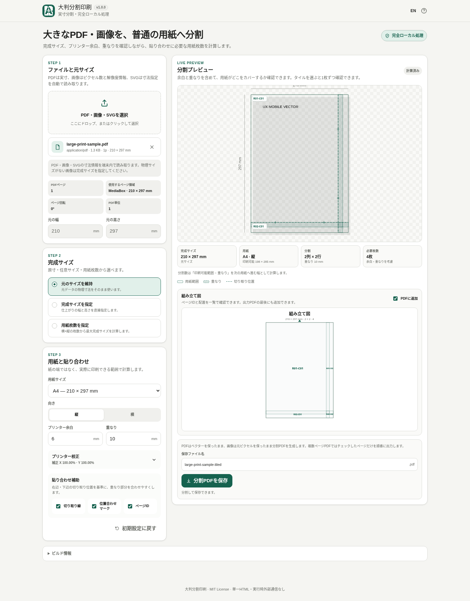

# Large Print Tiler / 大判分割印刷

[](https://github.com/ttomohisa/htmlapps-large-print-tiler/actions/workflows/deploy-pages.yml)
[](LICENSE)
[](https://ttomohisa.github.io/htmlapps-large-print-tiler/)

[English README](README.md)

PDF・画像・SVGを、意図した物理的な完成寸法を確認しながらA4・A3・Letterなどの普通の用紙へ分割し、貼り合わせ用PDFとして保存できる単一HTMLアプリです。

## 🚀 デモ

### [GitHub PagesでLarge Print Tilerを開く](https://ttomohisa.github.io/htmlapps-large-print-tiler/)

GitHub Pagesから最初のHTMLを読み込んだ後、ファイル解析、プレビュー、分割計算、プリンター校正、PDF生成は端末内で処理されます。選択したファイルをアプリがサーバーへアップロードすることはありません。

[](https://ttomohisa.github.io/htmlapps-large-print-tiler/)

## 主な機能

- **物理寸法を基準に分割** — PDFの元サイズを維持するほか、完成幅・高さを指定したり、必要な用紙枚数から完成サイズを逆算したりできます。
- **普通の用紙へ出力** — A4 / A3 / Letter、縦向き / 横向き、プリンター余白、重なり幅を設定できます。
- **PDFはベクターを維持して分割** — 対応PDFはページ内容を画像化せず、テキストやベクターを保ったまま分割PDFへ出力します。
- **保存前に配置を確認** — 分割グリッド、重なり、切り取り位置、位置合わせマーク、ページID、各用紙の実生成プレビューを確認できます。PDF表示には内包したPDF.jsを使います。
- **複数ページPDFに対応** — 出力する元ページを選択し、元ページ番号をページIDへ残せます。選択ページごとに組み立て図を追加することもできます。
- **画像サイズを勝手に決めない** — PNG / JPEG / WebP / SVGに対応。画像に印刷解像度情報がある場合は利用し、ラスター画像では完成サイズに対する実効PPIも表示します。
- **プリンターの縮尺ずれを補正** — 100 mm校正PDFを使い、プリンターやPDFビューアーによる拡大・縮小をX/Y別に補正できます。
- **PC・スマホで利用** — 日本語 / 英語、タッチ操作、生成進捗、キャンセル、保存ファイル名編集、スマホ下部アクションに対応しています。
- **読込後は完全ローカル処理** — PDF.js本体とWorkerを生成HTMLへ内包し、実行時の外部通信はCSPで遮断します。

## すぐに使う

### Webで使う

[GitHub Pagesのデモ](https://ttomohisa.github.io/htmlapps-large-print-tiler/)を開くだけで利用できます。インストールやアカウント登録は不要です。

### HTMLをダウンロードして使う

1. このリポジトリまたはリリースZIPから [`dist/index.html`](https://github.com/ttomohisa/htmlapps-large-print-tiler/blob/main/dist/index.html) をダウンロードします。
2. 最新のChromiumベースのブラウザ、Firefox、Safariで開きます。
3. PDF / PNG / JPEG / WebP / SVGを選び、端末内で分割PDFを作成します。

別形式として、自己展開型の単一HTML `dist/index.self-extract.html` も含まれています。

### 完全内包HTMLをビルドする（上級者向け）

1. このリポジトリをダウンロードまたはクローンします。
2. Windowsで `build-standalone.bat` をダブルクリックします。
3. キャッシュにない場合だけ、`dependencies.json` / `dependencies.lock.json` で固定された依存パッケージを取得します。
4. 生成された `dist/index.html` または `dist/index.self-extract.html` を使います。
5. 生成後のHTMLは、実行時CDN・API・ローカルWebサーバーなしで開けます。

通常のビルドにPythonやNode.jsは不要です。Windows PowerShellとWindows標準の `tar.exe` を使用します。

## 使い方

1. PDF / PNG / JPEG / WebP / SVGを選びます。複数ページPDFでは出力する元ページを選択します。
2. サイズ指定を **元サイズ** / **完成サイズ** / **用紙枚数** から選びます。
3. 用紙サイズ、向き、プリンター余白、重なり幅を設定します。
4. 分割プレビューを確認します。必要に応じて切り取り線、位置合わせマーク、ページIDを有効にします。
5. ラスター画像では、指定した完成サイズに対する実効PPIを確認します。
6. タイルを選び、実際に生成される1枚分の用紙を確認します。PDFでは、実際に生成した分割PDFの該当ページをPDF.jsで描画します。
7. 必要なら組み立て図を追加し、保存ファイル名を確認して分割PDFを保存します。生成中は進捗が表示され、キャンセルできます。

### 複数ページPDF

初期状態では全ページが出力対象です。除外したページは分割PDFにも組み立て図にも含まれません。元ページ番号は保持され、2ページ目だけを除外した場合でも `P01-R01-C01`、`P03-R01-C01` のようなIDになります。

**元サイズ**では各PDFページ固有の物理寸法を使います。完成サイズ、用紙枚数、用紙設定、重なり、プリンター校正は選択したページへ共通で適用されます。

### 画像・SVGのサイズ

PNG / JPEGに対応する印刷解像度情報が含まれている場合は、そこから物理サイズを算出します。利用できる物理サイズ情報がない画像へ、アプリが印刷DPIを勝手に仮定することはありません。その場合は **完成サイズ** を指定してください。

SVGの物理単位はそのまま読み取り、`px` はCSS基準の **96 px/in** として扱います。SVGは現在、分割PDFへ出力するときに画像化されます。

### プリンター校正

「100% / 実際のサイズ」で印刷しても少し小さい・大きい場合は、X/Yを別々に補正できます。

1. **100 mm校正PDF**を保存します。
2. **100% / 実際のサイズ**で印刷し、**ページに合わせる**などの自動拡大縮小をOFFにします。
3. 横・縦の100 mm基準線を実測します。
4. 実測値を入力し、**補正を分割PDFへ適用**をONにします。

たとえば100 mmが98 mmで印刷された場合、補正値は `100 / 98 = 102.04%` です。X/Yは独立して補正します。指定した完成サイズそのものは変えず、生成PDFの座標を補正します。

### 分割PDFを印刷するとき

生成したPDFは **100% / 実際のサイズ** で印刷してください。物理寸法を合わせたい場合は、**用紙に合わせる**、**Fit**、**大きなページを縮小**などの自動拡大縮小をOFFにします。

重なり、切り取り線、位置合わせマーク、ページIDは、印刷後に隣接する用紙を貼り合わせるための補助です。

## GitHub Pagesで公開する

このリポジトリには、standalone HTMLを再ビルドして `dist/` をGitHub Pagesへ公開するワークフローが含まれています。

1. リポジトリ名を `htmlapps-large-print-tiler` としてGitHubへプッシュします。
2. **Settings → Pages → Build and deployment → Source** で **GitHub Actions** を選択します。
3. `main` へプッシュするか、Actions画面から **Deploy standalone app to GitHub Pages** を手動実行します。
4. 成功後、`https://ttomohisa.github.io/htmlapps-large-print-tiler/` で利用できます。

`main` へのプッシュ時は、固定した依存関係から生成HTMLを作り直し、standalone配布物を検証してから公開します。

## 開発とビルド構成

```text
.
├─ src/index.template.html       # アプリ本体テンプレート
├─ app.config.json               # アプリ情報とビルド設定
├─ dependencies.json             # 依存ライブラリ設定
├─ dependencies.lock.json        # 依存ライブラリの整合性情報
├─ build-standalone.bat          # Windows用ビルド入口
├─ build-standalone.ps1          # standalone HTML生成処理
├─ dist/index.html               # 読みやすい単一HTML版
├─ dist/index.self-extract.html  # 自己展開型の単一HTML版
└─ .github/workflows/
   ├─ build-standalone.yml       # Pull Request時のビルド検証
   ├─ dependency-updates.yml     # 定期的な依存更新確認
   └─ deploy-pages.yml           # mainからPagesへ自動公開
```

### 依存ライブラリを更新する

`dependencies.json` を変更し、リポジトリのスクリプトでlock/build成果物を更新します。ローカルキャッシュを破棄して固定バージョンを再取得する場合：

```bat
build-standalone.bat -ForceDownload
```

ビルド処理は以下を自動で行います。

- 必要に応じてnpm公式レジストリから固定した `pdfjs-dist` を取得
- `dependencies.lock.json` と依存アーカイブの整合性を確認
- PDF.js本体とWorkerを生成HTMLへ内包
- 読みやすいstandalone版とself-extract版の両方を生成
- `dist/` にビルド・依存関係の情報を記録
- 外部依存、未置換プレースホルダー、favicon整合性、self-extract復元を検証

リポジトリ全体の検証はWindows PowerShell / PowerShell 7で `scripts/check-repository.ps1` を実行します。

## プライバシーと実行時通信

生成HTMLは、読込後に**完全ローカル処理**で動作する構成です。

- 選択したPDF・画像・SVGはブラウザ内で処理され、アプリから外部へアップロードしません。
- Content Security Policyで `connect-src 'none'` を指定しています。
- PDF.js本体とWorkerをHTMLへ内包し、実行時CDNへ依存しません。
- Analytics、telemetry、外部フォント、外部処理APIは使用しません。
- レイアウトや校正などの設定値だけをブラウザストレージへ保存する場合があります。

GitHub Pages版では最初のHTML取得だけ通信が発生します。ネットワークを完全に切った状態で使う場合は、生成済みの `dist/index.html` または `dist/index.self-extract.html` をローカルで開いてください。

## 制限事項

- 暗号化・パスワード保護されたPDFには対応していません。
- PDFの注釈、フォーム、リンクは、分割後のPDFへインタラクティブな要素として引き継ぎません。
- SVGは分割PDFへ出力するときに画像化されます。
- 利用できる物理サイズ情報がないラスター画像では、完成サイズを明示的に指定する必要があります。
- 大容量PDFや高解像度画像は、ブラウザや端末のメモリ・Canvas上限の影響を受けます。
- アプリが扱えるピクセル面積を超える画像は、不安定な処理を避けるため読み込みを中止する場合があります。
- プリンタードライバーやPDFビューアー側で独自の拡大縮小が行われる場合があります。物理寸法が重要な場合は校正機能を使い、最終PDFを100% / 実際のサイズで印刷してください。
- このアプリの出力は分割印刷・貼り合わせ用です。元PDFの注釈やフォーム動作など、文書レベルの機能保持は現在の対象外です。

## 使用ライブラリ

| ライブラリ | バージョン | ライセンス | 用途 |
| --- | ---: | --- | --- |
| PDF.js (`pdfjs-dist`) | 6.3.289 | Apache-2.0 | PDFプレビューのローカル描画 |

PDF分割・出力、画像解析、SVG処理、レイアウト計算、UI操作はアプリ側で実装しています。依存ライブラリの詳細は [THIRD_PARTY_NOTICES.md](THIRD_PARTY_NOTICES.md) を確認してください。

## コントリビューション

バグ報告や機能提案はGitHub Issuesからお願いします。開発方法は [CONTRIBUTING.md](CONTRIBUTING.md) を確認してください。

## ライセンス

Copyright © 2026 ttomohisa

このプロジェクトは [MIT License](LICENSE) で公開されています。
