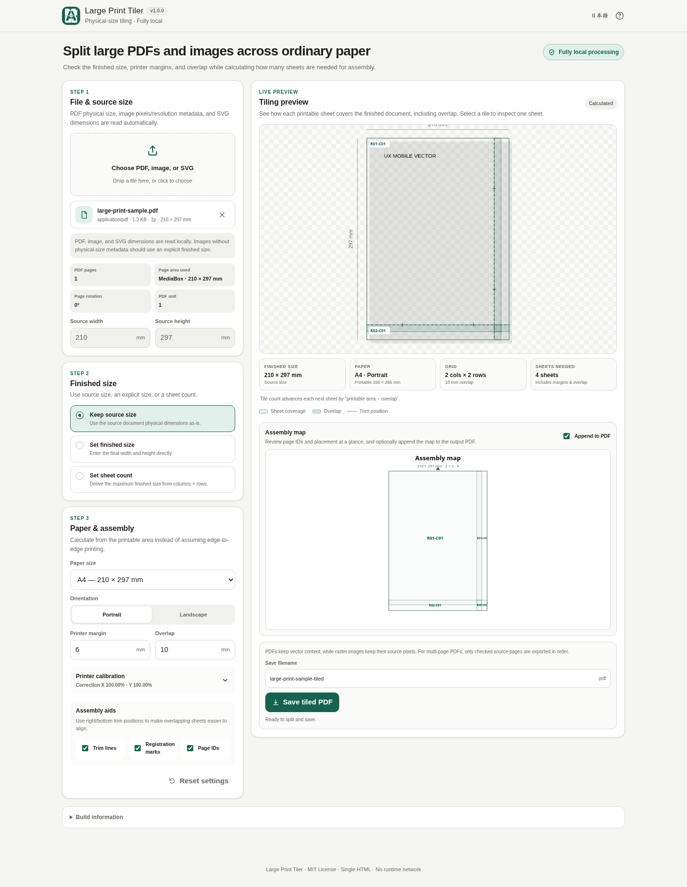

# Large Print Tiler

[](https://github.com/ttomohisa/htmlapps-large-print-tiler/actions/workflows/deploy-pages.yml)
[](LICENSE)
[](https://ttomohisa.github.io/htmlapps-large-print-tiler/)

[日本語版 README](README.ja.md)

A single-HTML browser app for splitting PDFs, images, and SVGs across ordinary paper such as A4, A3, or Letter while keeping the intended physical finished size explicit.

## 🚀 Live demo

### [Open Large Print Tiler on GitHub Pages](https://ttomohisa.github.io/htmlapps-large-print-tiler/)

GitHub Pages only delivers the initial HTML. After the app loads, source-file parsing, preview, tiling calculation, calibration, and PDF generation are processed locally on your device. Files selected in the app are not uploaded to a server.

[](https://ttomohisa.github.io/htmlapps-large-print-tiler/)

## Features

- **Tile by real-world size** — Keep a source PDF's physical size, enter a finished width/height, or derive the finished size from a requested sheet count.
- **Use ordinary paper** — A4, A3, and Letter are supported in portrait or landscape, with configurable printer margins and overlap.
- **Keep PDF content as PDF** — Supported PDF pages are tiled without rasterizing their page content, preserving text and vector graphics in the generated PDF.
- **Check the result before saving** — See the full tiling grid, overlap, trim positions, registration marks, page IDs, and individual generated sheets. PDF previews are rendered locally with embedded PDF.js.
- **Work with multi-page PDFs** — Choose which source pages to export, keep their original page numbers in tile IDs, and optionally add an assembly map for each selected page.
- **Handle images deliberately** — PNG, JPEG, WebP, and SVG are supported. Embedded print-resolution metadata is used when available, and effective PPI is shown for raster images.
- **Correct printer scaling** — Generate a 100 mm calibration page and apply independent X/Y correction when a printer or PDF viewer does not reproduce physical size exactly.
- **Use it on desktop or mobile** — Japanese/English UI, touch-friendly controls, export progress, cancellation, editable filenames, and a mobile bottom action are included.
- **Run fully locally after load** — PDF.js and its worker are embedded in the generated HTML. Runtime external connections are blocked by CSP.

## Quick start

### Use the web demo

Open the [GitHub Pages demo](https://ttomohisa.github.io/htmlapps-large-print-tiler/). No installation or account is required.

### Use the downloaded HTML

1. Download [`dist/index.html`](https://github.com/ttomohisa/htmlapps-large-print-tiler/blob/main/dist/index.html) from this repository or from a release archive.
2. Open it in a current Chromium-based browser, Firefox, or Safari.
3. Choose a PDF, PNG, JPEG, WebP, or SVG file and create the tiled PDF locally.

`dist/index.self-extract.html` is also included as an alternate self-extracting single-file distribution.

### Build the fully embedded HTML (advanced)

1. Download or clone this repository.
2. On Windows, double-click `build-standalone.bat`.
3. The build downloads the exact dependency versions pinned in `dependencies.json` and `dependencies.lock.json` when they are not already cached.
4. Use the generated `dist/index.html` or `dist/index.self-extract.html`.
5. The generated files can be opened later without a runtime CDN, API, or web server.

Python and Node.js are not required for the normal build. The builder uses Windows PowerShell and the built-in `tar.exe`.

## Usage

1. Choose a PDF, PNG, JPEG, WebP, or SVG file. Multi-page PDFs let you choose which source pages will be included.
2. Select **Source size**, **Finished size**, or **Sheet count** as the sizing mode.
3. Choose the paper size, orientation, printer margin, and overlap.
4. Check the live tiling preview. Enable trim lines, registration marks, or page IDs when they are useful for assembly.
5. For raster images, review the effective PPI shown for the selected finished size.
6. Select a tile to inspect the actual generated sheet preview. For PDFs, the sheet preview is rendered from the generated tiled PDF itself.
7. Optionally add an assembly map, confirm the output filename, and save the tiled PDF. Generation progress is shown and can be cancelled.

File selection and removal pause during export. To change the source, cancel or wait for completion. Undo also re-reads a file removed while it was still loading.

### Multi-page PDFs

All pages are selected by default. Excluded pages generate no tiles or assembly maps. Tile IDs retain the original source page number, for example `P01-R01-C01` and `P03-R01-C01` when page 2 is excluded.

Source-size mode uses each PDF page's own physical dimensions. Finished-size, sheet-count, paper, overlap, and printer-calibration settings are shared across the selected pages.

### Image and SVG sizing

For PNG/JPEG files with supported print-resolution metadata, the app can derive the physical source size. Files without usable physical-size metadata are not silently assigned a print DPI; use **Finished size** instead.

SVG physical units are read directly. SVG `px` values use the CSS reference conversion of **96 px/in**. SVG is currently rasterized when it is written into the tiled PDF.

### Printer calibration

If 100% / Actual size still prints slightly too small or too large:

1. Save the **100 mm calibration PDF**.
2. Print it at **100% / Actual size** with **Fit to page** or similar automatic scaling disabled.
3. Measure the horizontal and vertical 100 mm references.
4. Enter the measured values and enable **Apply correction to tiled PDF**.

For example, if a 100 mm reference prints as 98 mm, the correction is `100 / 98 = 102.04%`. X and Y are corrected independently. The requested finished size remains unchanged; the generated PDF coordinates are adjusted instead.

### Printing the tiled PDF

Print the generated PDF at **100% / Actual size**. Disable options such as **Fit**, **Fit to page**, **Shrink oversized pages**, or other automatic scaling if physical dimensions matter.

The overlap, trim lines, registration marks, and page IDs are intended to help align adjacent sheets after printing.

## Publish with GitHub Pages

The repository includes a workflow that rebuilds the standalone HTML and deploys `dist/` to GitHub Pages.

1. Push the repository to GitHub as `htmlapps-large-print-tiler`.
2. Open **Settings → Pages → Build and deployment → Source** and select **GitHub Actions**.
3. Push to `main`, or manually run **Deploy standalone app to GitHub Pages** from the Actions tab.
4. After a successful deployment, the app is available at `https://ttomohisa.github.io/htmlapps-large-print-tiler/`.

Each push to `main` rebuilds the generated HTML from pinned dependencies and verifies the standalone artifacts before publishing them.

## Development and build layout

Source-only lifecycle regression tests require Node.js 22 or newer. Run `node --test tests/*.test.cjs` or the full `scripts/check-repository.ps1` check. The full check validates the committed root entry point before rebuilding and tests the source and both readable HTML entry points. Browser-based regression scripts remain separate. The default build also refreshes `large-print-tiler.html`; an explicit `-OutputPath` leaves that root entry point unchanged.

```text
.
├─ src/index.template.html       # Application template
├─ app.config.json               # App metadata and build settings
├─ dependencies.json             # Pinned dependency configuration
├─ dependencies.lock.json        # Resolved dependency integrity data
├─ build-standalone.bat          # Windows build entry point
├─ build-standalone.ps1          # Standalone HTML builder
├─ dist/index.html               # Generated readable standalone app
├─ dist/index.self-extract.html  # Generated self-extracting variant
└─ .github/workflows/
   ├─ build-standalone.yml       # Pull request build validation
   ├─ dependency-updates.yml     # Scheduled dependency check
   └─ deploy-pages.yml           # Automatic Pages deployment from main
```

### Update dependencies

Edit `dependencies.json`, then regenerate the lock/build artifacts with the repository scripts. To discard the local package cache and download the pinned package again:

```bat
build-standalone.bat -ForceDownload
```

The build process automatically:

- Downloads the pinned `pdfjs-dist` package from the npm registry when needed
- Verifies the dependency archive against `dependencies.lock.json`
- Embeds the PDF.js main module and worker into the generated HTML
- Generates both readable and self-extracting single-HTML variants
- Records build/dependency metadata under `dist/`
- Verifies standalone constraints, unresolved placeholders, favicon consistency, and self-extract restoration

For the repository-wide verification flow, run `scripts/check-repository.ps1` on Windows PowerShell / PowerShell 7.

## Privacy and runtime network protection

The generated app is designed for **fully local processing** after the HTML is loaded.

- Selected PDFs, images, and SVG files are processed in the browser and are not uploaded by the app.
- The generated HTML uses a Content Security Policy containing `connect-src 'none'`.
- PDF.js and its worker are embedded; there is no runtime CDN dependency.
- The app does not use analytics, telemetry, external fonts, or an external processing API.
- Only local settings such as layout/calibration choices may be stored in browser storage.

The GitHub Pages version requires the initial HTML request. For operation with the network completely disconnected, open the generated `dist/index.html` or `dist/index.self-extract.html` locally.

## Limitations

- Encrypted or password-protected PDFs are not supported.
- PDF annotations, forms, and links are not preserved as interactive objects in the tiled output.
- SVG input is rasterized when exported to the tiled PDF.
- Raster images without supported physical-size metadata require an explicit finished size.
- Very large PDFs or high-resolution images can exceed browser/device memory or canvas limits.
- Raster images above the app's supported pixel-area limit may be rejected instead of risking an unstable browser session.
- Printer drivers and PDF viewers can still apply their own scaling. Use the calibration feature when physical dimensions must be accurate, and print the final PDF at 100% / Actual size.
- The generated PDF is intended for tiling and assembly; document-level PDF features such as original annotations or interactive form behavior are outside the current scope.

## Dependencies

| Library | Version | License | Purpose |
| --- | ---: | --- | --- |
| PDF.js (`pdfjs-dist`) | 6.3.289 | Apache-2.0 | Local PDF preview rendering |

PDF tiling/export logic, image parsing, SVG handling, layout calculation, and UI interactions are implemented in the app itself. See [THIRD_PARTY_NOTICES.md](THIRD_PARTY_NOTICES.md) for dependency notices.

## Contributing

Bug reports and feature proposals are welcome through GitHub Issues. See [CONTRIBUTING.md](CONTRIBUTING.md) for development guidance.

## License

Copyright © 2026 ttomohisa

Licensed under the [MIT License](LICENSE).
